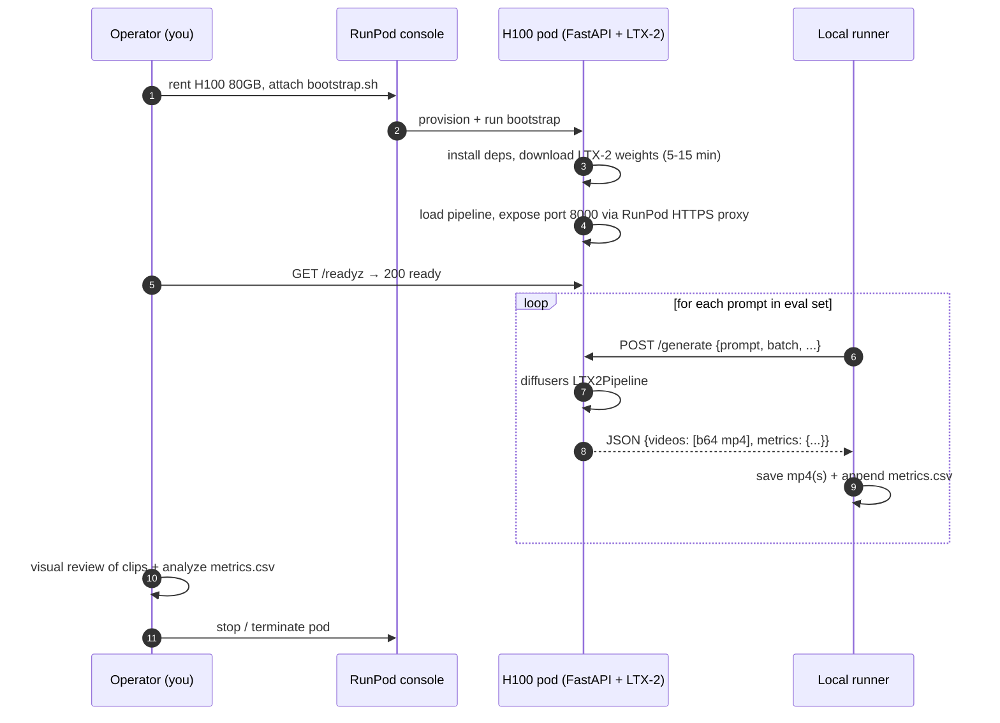

# LTX-2 GPU POC — playbook

**Goal**: in ~2 hours and ~$5 of GPU rental, generate ~80 video clips that
tell us whether self-hosted LTX-2 on H100 80 GB is good enough — in quality,
latency, and parallel-batching headroom — to commit to a self-host
architecture.

**Status**: ready to execute.
**Last updated**: 2026-05-12.

> This is a **proof-of-concept only**. It is intentionally minimal:
> - No database, no auth beyond a bearer token, no orchestration.
> - Single-process FastAPI server on a single GPU pod.
> - All results land as local files. Visual review happens manually.
> Production architecture decisions follow the POC, not the other way around.

---

## What's in this folder

```
poc/
├── pod/                      # runs on the rented GPU pod
│   ├── server.py             # FastAPI: /healthz /readyz /info /generate
│   ├── bootstrap.sh          # one-command pod setup
│   └── requirements.txt
├── runner/                   # runs on your local machine
│   ├── run_pod_eval.py       # drives the 40-prompt eval against the pod
│   ├── prompts.py            # 40-prompt set (6 categories, 6 languages)
│   ├── configs.yaml          # eval matrix
│   └── requirements.txt
└── README.md                 # ← you are here
```

---

## Architecture (POC only)



---

## Cost envelope

| Item | Estimate |
|---|---|
| RunPod H100 80 GB (~$2.99/hr Community/Secure) | ~$6.00 over 2 hrs |
| Container Disk 40 GB (~$0.006/hr) | ~$0.01 |
| Volume Disk 200 GB (~$0.028/hr) | ~$0.06 |
| Network egress (~400 MB of clip downloads) | $0 (included) |
| HuggingFace bandwidth | $0 (free) |
| **Total budget** | **~$6** |

> Note on disk sizes: LTX-2 with the current `allow_patterns` downloads
> 46 files averaging ~4 GB each (≈ 184 GB total — Gemma3-12B text encoder
> + distilled-fp8 transformer + VAE + xet temp chunks). 200 GB Volume Disk
> gives a safe margin; 100 GB does **not** fit (verified empirically).

---

## Step 1 — Prep on your local machine (5 min, no GPU rented yet)

```bash
cd <repo>/poc/runner
python3 -m venv .venv
source .venv/bin/activate
pip install -r requirements.txt

# verify the 40 prompts load:
python run_pod_eval.py --config smoke --dry-run
```

Expected output: a single line for prompt `EN-1`.

Also: have your **HuggingFace token** (with read access to `Lightricks/LTX-2`)
ready. Generate at https://huggingface.co/settings/tokens.

Generate a **strong shared secret** for the pod-to-runner bearer token:

```bash
export POD_AUTH_TOKEN="$(openssl rand -hex 32)"
echo $POD_AUTH_TOKEN   # ← keep this, you'll paste it into the RunPod env vars too
```

---

## Step 2 — Rent the pod (5 min, billing starts)

1. Go to https://www.runpod.io/console/deploy
2. **GPU type**: `H100 SXM` 80 GB VRAM (Community or Secure Cloud)
3. **Template** — THIS IS THE #1 CAUSE OF FAILED DEPLOYS. Read carefully:
   - Click the **Official** filter at the top of the template picker.
   - Search for the **exact** image tag `runpod/pytorch:1.0.2-cu1281-torch280-ubuntu2404`.
     The template name in the UI is **"Runpod Pytorch 2.8.0"** but RunPod
     sometimes also exposes older "PyTorch" or "RunPod Pytorch 2.4" entries
     near the top — those will NOT work (LTX-2 requires torch >= 2.7).
   - Verify the **exact image tag** in the right-hand template panel before
     clicking Deploy. The tag MUST contain `torch280` and `cu1281`.
   - Provides Python 3.12, torch 2.8.0+cu128, CUDA 12.8.1, Ubuntu 24.04.
   - The bootstrap script has a hard guard that detects torch < 2.7 or
     Python < 3.12 and halts (`sleep infinity`) instead of letting the pod
     restart-loop. If your deploy hangs after the banner with a "WRONG RUNPOD
     TEMPLATE" message in logs, you picked the wrong template — terminate
     and redeploy.
4. Open the **Pod template overrides** dialog and set exactly:

   | Field | Value |
   |---|---|
   | Container image | `runpod/pytorch:1.0.2-cu1281-torch280-ubuntu2404` (prefilled by template) |
   | Container Start Command | `bash -lc "curl -sSL 'https://raw.githubusercontent.com/sarhej/avatarooms-video-inference/main/poc/pod/bootstrap.sh?v=1' -o /tmp/b.sh && bash /tmp/b.sh"` |
   | Container disk | **40 GB** (apt + pip cache + system) |
   | **Volume disk** | **200 GB** ← critical, see disk-sizing note in cost section |
   | Volume mount path | `/workspace` |
   | Expose HTTP ports | `8000` |
   | Expose TCP ports | `22` (harmless, unused; auto-prefilled by template) |
   | Start Jupyter notebook | unchecked |
   | SSH terminal access | unchecked (no SSH key needed) |

5. **Environment variables** (expand the env vars panel and add all four):

   | Key | Value |
   |---|---|
   | `POD_AUTH_TOKEN` | `<the secret you generated in Step 1>` |
   | `HF_TOKEN` | `<your huggingface token, hf_…>` |
   | `LTX2_VARIANT` | `distilled-fp8` |
   | `PORT` | `8000` |

6. Triple-check **Volume disk = 200 GB** before clicking Deploy — RunPod has
   a habit of silently resetting that field if you tab through other inputs.

7. Click **Deploy**.

> The `?v=1` cache-buster in the Container Start Command sidesteps a quirk
> where `raw.githubusercontent.com` caches responses for 5 minutes. If you
> ever push a new bootstrap version, bump the version number (e.g. `?v=2`)
> in the start command and restart the pod to pick it up immediately
> instead of waiting for the cache.

> Web Terminal access: once the pod is running, click **Connect → Web Terminal**
> in the pod's page. It's automatic in current RunPod UI — there's no
> deploy-time toggle for it.

---

## Step 3 — Wait for the pod to come up (20–25 min)

In the RunPod console, click your pod → **Logs**. You'll see these stages
in order:

```
== CUDA == ... (1× container banner)

[bootstrap] Pre-cleanup disk state
[bootstrap] Inventory of /workspace BEFORE cleanup:           ← v3 diagnostic
[bootstrap] No sentinel — AGGRESSIVE cleanup: wiping ALL ...
[bootstrap] Post-cleanup disk state
    /dev/md0  200G  296K  200G   1% /workspace                ← clean start

[bootstrap] Sanity check: GPU + Python versions
NVIDIA H100 80GB HBM3, 81559 MiB
Python 3.12.3
torch 2.8.0+cu128 cuda True

[bootstrap] Installing system packages (ffmpeg, git, build tools)    (~1-2 min)
[bootstrap] Checking out repo: ...                                   (~10s)
[bootstrap] Installing Python deps from poc/pod/requirements.txt     (~3-5 min)

[bootstrap] Pre-downloading LTX-2 (variant=distilled-fp8)            (~10-20 min)
Fetching 46 files: 100%|████████| 46/46 ...
LTX-2 weights cached.

[bootstrap] Disk state after HF download
    /dev/md0  200G  ~184G  ~16G  92% /workspace                ← tight but OK

[bootstrap] Launching pod server on port 8000 (variant=distilled-fp8)
Loading LTX-2 variant=distilled-fp8 …
Pipeline ready in ~47s
INFO:     Uvicorn running on http://0.0.0.0:8000
```

Once you see `Uvicorn running on http://0.0.0.0:8000`, the pod is ready.

Click **Connect** → **HTTP Service [Port 8000]** and copy the URL — it
looks like `https://abcdef123-8000.proxy.runpod.net`. **That's your `POD_URL`.**

From your local machine:

```bash
export POD_URL=https://abcdef123-8000.proxy.runpod.net
curl -s "${POD_URL}/readyz"
# {"status":"ready","variant":"distilled-fp8"}

curl -s -H "Authorization: Bearer $POD_AUTH_TOKEN" "${POD_URL}/info" | jq .
# {"variant":"distilled-fp8","gpu_name":"NVIDIA H100 80GB HBM3", ...}
```

### Common failure modes seen during the POC build-out

| Symptom in logs | Cause | Fix |
|---|---|---|
| `/tmp/b.sh: line 1: 404:: command not found` | bootstrap.sh URL returns 404 (private repo or wrong path) | repo must be **public**; verify with `curl -I <raw url>` returns HTTP 200 |
| `ERROR: POD_AUTH_TOKEN must be set` / `ERROR: HF_TOKEN must be set` | env var missing or RunPod silently dropped it on save | edit pod settings, add the missing var, restart |
| `OSError: No space left on device` during HF download | Volume Disk too small for LTX-2 (model is ~184 GB) | redeploy with **Volume Disk = 200 GB** |
| Bootstrap stuck on old script even after push | `raw.githubusercontent.com` 5-min cache | bump the `?v=N` cache-buster in the start command and restart |

---

## Step 4 — Smoke test (3 min, ~$0.10)

```bash
cd poc/runner
source .venv/bin/activate
export POD_URL=https://abcdef123-8000.proxy.runpod.net
export POD_AUTH_TOKEN=<same secret as on the pod>

python run_pod_eval.py --config smoke
```

Expected output:

```
Config:    smoke  (single-prompt smoke test)
Variant:   distilled-fp8  batch=1  res=1080p  ar=9:16
Prompts:   1 selected  seed=42
Output:    /…/runs/smoke
Probing /readyz …
  ready: variant=distilled-fp8
  GPU: NVIDIA H100 80GB HBM3  81559 MB total VRAM
  Load duration: 47312 ms

✓  [ 1/ 1] EN-1     61243ms wall  58117ms infer  peak=42316MB  × 1 clips
Done.
```

Open `runs/smoke/EN-1__0.mp4` and watch it. If the bearded knight speaks his
line and the audio syncs roughly to his mouth, we're in business.

> **Sanity bar for smoke test**:
> - mp4 plays in a normal video player
> - duration is ~10 s
> - resolution is 1080×1920 (portrait)
> - audio is audible and roughly in English
> - peak VRAM under 60 GB (leaves headroom for batching)

If smoke fails — see "Troubleshooting" below.

---

## Step 5 — Run the full primary config (30–35 min, ~$1.20)

```bash
python run_pod_eval.py --config distilled_fp8_batch1
```

Watch the progress bar. After ~30 min you should have:

```
runs/distilled_fp8_batch1/
├── info.json
├── info_final.json
├── metrics.csv
├── EN-1__0.mp4
├── EN-2__0.mp4
├── ... 40 clips total
└── LONG-5__0.mp4
```

Quick sanity check on the metrics:

```bash
python -c "
import csv
rows = list(csv.DictReader(open('runs/distilled_fp8_batch1/metrics.csv')))
print(f'n_success: {sum(1 for r in rows if r[\"success\"]==\"true\")}')
print(f'mean inference_ms: {sum(int(r[\"inference_ms\"]) for r in rows)/len(rows):.0f}')
print(f'max peak_vram_mb:  {max(int(r[\"peak_vram_mb\"]) for r in rows)}')
"
```

---

## Step 6 — Batching configs (15–20 min, ~$0.80)

These reuse the same loaded model (no pod restart needed).

```bash
python run_pod_eval.py --config distilled_fp8_batch2
python run_pod_eval.py --config distilled_fp8_batch3
```

The key metric per config is the ratio:

```
inference_ms_batch_N / inference_ms_batch_1  /  N
```

If it's ≤ 1.0, batching is "free" (linear scaling). If it's 1.0–1.4,
batching is "cheap" (we still win). If it's > 1.5, the GPU is saturated and
batching costs more than it saves.

---

## Step 7 — Quality ceiling: dev variant (35–40 min, ~$1.30)

This needs a **pod restart** because the model variant changes.

In the RunPod console: pod → **Restart** → before clicking it, update env vars:

- Change `LTX2_VARIANT=distilled-fp8` → `LTX2_VARIANT=dev`

Bootstrap will skip the apt/pip steps (cache hit) and re-download only the dev
weights (~5 min). Wait for `/readyz` again, then:

```bash
python run_pod_eval.py --config dev_bf16_batch1
```

---

## Step 8 — Tear down

In the RunPod console: pod → **Stop** → **Terminate**.

Double-check the billing summary. If you stayed within $5, that's the POC done.

---

## Step 9 — Decide

Open the clips in `runs/*` and rate them on whatever rubric you're using.

**GO criteria** (all must be true to proceed with a self-host architecture):

| # | Criterion | How to measure |
|---|---|---|
| 1 | **Quality**: ≥70% of 40 distilled clips score 3/5 or above on the rubric | manual review |
| 2 | **Quality ceiling**: dev/full clips show a noticeable bump over distilled (≥1 point per rubric) | side-by-side review |
| 3 | **Distilled latency**: median `inference_ms` ≤ 60 000 ms for 1080p/10s | `metrics.csv` |
| 4 | **Batch=2 efficiency**: `(batch2_ms / batch1_ms) / 2` ≤ 1.0 (linear or better) | math |
| 5 | **Batch=3 fits**: peak VRAM at batch=3 < 78 GB (no OOM) | `metrics.csv` |
| 6 | **Reliability**: zero crashes/OOM in 80+ generations | log review |

**NO-GO triggers** (any one is enough to walk away):

- LTX-2 quality clearly below the corresponding hosted-API version of LTX-2
  (would indicate distilled+self-host has a quality cliff vs cloud)
- Batch=2 inference scales worse than 1.5× (means batching doesn't recover
  the H100's hourly cost)
- OOM at batch=3 *and* batch=2 efficiency is poor (no path to
  cost-competitive throughput)
- Cold-start > 5 min for the pipeline alone (production unacceptable without
  a weight-cache warmer)

---

## Manual mode (bypass the Container Start Command)

After the pod boots into a usable state, click **Connect → Web Terminal**
and run:

```bash
cd /workspace
git clone --depth=1 https://github.com/sarhej/avatarooms-video-inference.git poc
export POD_AUTH_TOKEN=...
export HF_TOKEN=...
export LTX2_VARIANT=distilled-fp8
export PORT=8000
bash poc/poc/pod/bootstrap.sh
```

(The bootstrap is idempotent — it detects existing clones, refreshes them,
wipes partial state from any prior failed runs, and continues.)

---

## Troubleshooting (during inference, after the pod is running)

| Symptom | Likely cause | Fix |
|---|---|---|
| Pod logs show `[bootstrap] WRONG RUNPOD TEMPLATE` and bootstrap is sleeping | RunPod template ships torch 2.4 / Py3.11 instead of torch 2.8 / Py3.12 | **Terminate** the pod (don't try to fix in place) and redeploy with the **exact** `runpod/pytorch:1.0.2-cu1281-torch280-ubuntu2404` image tag. Bootstrap intentionally halts instead of letting RunPod restart-loop and burn money. |
| Pod logs show the CUDA banner + `Python 3.11` / `torch 2.4.x` repeated dozens of times every ~30 s | Same as above — wrong template causing diffusers to fail to build from source, container exits, RunPod auto-restarts | **Terminate immediately** (every restart cycle costs money), then redeploy with the correct template |
| `infer_schema(func): Parameter input has unsupported type torch.Tensor` when loading LTX2Pipeline | torch < 2.7 cannot resolve string forward references in diffusers' FP8 grouped-matmul custom op | Same as the wrong-template row — you need torch ≥ 2.7. Terminate and redeploy. |
| Bootstrap fails at `LTX2Pipeline` import on a torch≥2.7 pod | diffusers pinned version (0.36.0) predates the FP8 schema fix | edit `poc/pod/requirements.txt`, swap the pinned diffusers for `diffusers @ git+https://github.com/huggingface/diffusers.git@main`, re-run bootstrap |
| `RuntimeError: CUDA out of memory` at load | other process holding VRAM | `nvidia-smi`, kill stragglers, restart pod |
| `RuntimeError: CUDA out of memory` at batch=3 | LTX-2 + text encoder + activations exceeds 80 GB | drop batch to 2, or enable `pipe.enable_model_cpu_offload()` in `server.py` |
| `/generate` returns 401 | bearer token mismatch | re-export `POD_AUTH_TOKEN` in both runner and pod |
| Audio missing in mp4 | LTX-2 returned `None` for audio (rare on multilingual prompts) | check `metrics.csv` `has_audio` column; this is a known LTX-2 limitation for some languages |
| Long pod startup | first-time HuggingFace cache, network slow | use a network volume next time so weights persist between rentals |
| Clip looks corrupted (green frames, glitches) | FP8 numerical instability | drop variant to `distilled-bf16` and re-run smoke; if BF16 works, FP8 needs a Diffusers patch |
